# The connected UrjaSetu system

Implementation guide, 13 September 2026. The transaction engines below remain in use. The [household experience guide](16_HOUSEHOLD_EXPERIENCE.md) describes the current registration, personalized model, direct purchasing, real-clock worker and redesigned pages; its details supersede the earlier fixed-profile/operator presentation in this document.

## Follow one unit of energy

Asha's rooftop system may produce more electricity than her home uses. Ravi has demand. They agree on an allocation and a price for the same 15-minute interval. The distribution grid still carries the electricity. The platform records the agreement and evidence; it does not direct particular electrons from one house to another.

```mermaid
flowchart LR
    A[Account and fictional site] --> B[Synthetic bidirectional readings]
    B --> C[Tomorrow's solar and load forecast]
    C --> D[Authenticated bids and offers]
    D --> E[Price-priority matching]
    E --> F[Power-flow safety and final-price checks]
    F --> G[Committed trade]
    B --> H[Completed delivery readings]
    G --> I[Allocate actual available energy]
    H --> I
    I --> J[Balanced INR demonstration journal]
    J --> K[Durable receipt publication job]
    K --> L[Solidity contract on local EVM]
    L --> M[Browser verifies stored hash]
```



The coordinator is `backend/app/services/workspace_service.py`. The existing matching, forecasting, pricing and grid engines still perform the calculations. React loads an authenticated workspace snapshot; a WebSocket tells it when the shared database revision changes. This gives each user their own data plus the shared order book, without broadcasting another household's private readings.

## What data is real?

| Data | Source and meaning |
|---|---|
| Account, orders, trades, journals | Actual application records created by the user or transactional coordinator |
| Household solar/load/import/export | Generated synthetic 15-minute averages and interval energy; `source=simulator` |
| Forecasts | Historical-average predictions from preceding synthetic readings; stored separately from delivery |
| Ahmedabad weather | Successful free Open-Meteo current-weather API integration; model estimates, not rooftop measurements |
| Grid topology and ratings | Fictional 11 kV source, 400 V community transformer and household connections |
| Voltage and loading results | Actual Power Grid Model solver output for the assumed network and forecast schedule |
| Prices | Computed from participants' bids/offers and the provisional pricing formula; no wholesale/retail price feed |
| INR balances | Simulated accounting; no bank transfer or prepaid-wallet funds |
| Blockchain transactions | Actual mined transactions on persistent local Ganache, chain ID 1337; no public-network security claim |

Weather refreshes every 15 real minutes. It is retained as separate backend context and does **not** drive this synthetic profile. A present weather observation must not be relabelled as tomorrow's weather merely because the simulation clock advances.

The public data research and access limitations are in [the research record](13_DATA_RESEARCH_AND_DELIVERY_PLAN.md). Open-Meteo documents its [forecast variables](https://open-meteo.com/en/docs) and [free-tier terms and attribution](https://open-meteo.com/en/terms). Real meters require authorized device/utility access; inverter generation alone cannot establish exported energy.

## Synthetic model and units

`community_energy.py` identifies the model as `gujarat-household-1`. It is deterministic: the same date, capacity and scenario produce the same result. The model uses the interval midpoint in Asia/Kolkata and Ahmedabad latitude 23.0225°. It approximates seasonal daylight using solar declination and an assumed solar noon of 12:40 IST:

```text
declination = 23.44° × sin(2π × (day_of_year − 81) / 365)
hour_angle = 15° × (local_hour − 12.67)
daylight = max(0, sin(latitude)sin(declination)
                  + cos(latitude)cos(declination)cos(hour_angle))
solar_kW = installed_capacity_kW × daylight × 0.87
```

The 0.87 loss factor is an assumption. This is a clear-day envelope, not a calibrated irradiance/temperature/inverter model. Cloudy delivery multiplies generation by 0.28. Congestion deliberately adds 65 kW of demand at each connection to create an obvious overload test; that scenario is an artificial stress case.

Demand combines a base, repeatable within-day variation, a morning bump and an evening bump. The consumer uses a deliberately large base of 1.9 kW; the prosumer uses 0.65 kW. On 13 September 2026, the full-day model totals are approximately 37.95 kWh generation and 22.52 kWh consumption for the 6 kW prosumer, and 54.47 kWh consumption for the high-demand consumer. **These are selected demonstration households, not average Indian residential consumption or a measured Gujarat dataset.** Treat the high-demand buyer as a stress/AC-heavy household. Dataset calibration is not claimed.

The model has no battery. At the household boundary:

```text
import_kW = max(load_kW − solar_kW, 0)
export_kW = max(solar_kW − load_kW, 0)
interval_kWh = interval_average_kW × 0.25 hours
solar_kWh + import_kWh = load_kWh + export_kWh
```

A kW is a rate; a kWh is energy over time. Ten minutes of missing readings cannot be silently replaced with a full interval's delivery. Readings must match both delivery boundaries and have valid quality. Decimal storage uses four decimal places for energy and two for journal money; quantization can introduce last-digit rounding in displayed interval balances.

This is Indian time/units and a fictional Indian voltage context. It is not a standards certification. Feeder impedance/rating assumptions and provisional price coefficients still need actual utility data before physical or financial deployment.

## Forecast, matching and pricing maths

New household registration provides 30 days; the legacy bootstrap initially supplied seven. For each next-day 15-minute slot, the baseline averages previous readings for the same time of day, separately for solar and load. No future delivered sample is fed into its own forecast. Confidence is the engine's sample/stability heuristic, not a calibrated probability of delivery. Predictions and forecast runs remain stored so a trade can refer to its basis.

The server permits a sell order only within forecast net surplus:

```text
available = max(0, forecast_solar_kWh − forecast_load_kWh)
reserved = committed matched quantities
           + remaining quantities on active sell orders
new_sell_quantity ≤ available − reserved
```

A PostgreSQL row lock serializes mutations for this small community. Two requests cannot both reserve the same remaining capacity. Cancellation releases the unfilled reservation; committed quantities remain reserved even if a later proposal for the order is rejected.

Matching uses price priority, then creation time, then UUID as a deterministic tie-break. Highest buyer limits meet lowest seller asks. The matcher skips self-trades. Trades use identical 15-minute delivery intervals in this workspace. Quantity is the smaller remaining bid/offer quantity. The base price is the midpoint:

```text
base = (seller_minimum + buyer_maximum) / 2
final = base + time + congestion + uncertainty + local_renewable
```

Current illustrative pricing parameters are centralized in `dynamic_pricing.py`: the 09:00–16:00 IST band subtracts 5% of base; 18:00–22:00 adds 10%; congestion ramps from 70% loading toward a 25% cap; confidence shortfall adds 10% × (1 − confidence) × base; eligible local renewable supply subtracts 5% of base. These change the price paid by the buyer and received by the seller together; no unfunded third-party reward is booked. The formula version and each component are stored.

For a ₹4 sell limit and ₹6 buy limit, base is ₹5. With full baseline confidence, a safe noon trade typically becomes ₹4.50 after the two 5% adjustments. A 0.3 kWh delivery then produces ₹1.35 accounting entries. The server checks the **final** price against both original limits. A price that crosses a limit is not committed.

The operating envelope currently uses 0.94–1.06 per-unit voltage and 100% line/transformer loading as configurable demo defaults. The solver validates the combined forecast of the whole feeder. Matching allocates that forecast; adding trade energy again as extra generation would double-count the physical schedule. Unknown or unsafe outcomes block commitment.

A market without compatible bids and offers has no execution price. Offer cards show submitted limits; accepted trades expose the stored final price and its components.

## Delivery, money and blockchain

For each due trade, settlement allocates:

```text
delivered = min(committed_quantity,
                seller_export_not_already_allocated,
                buyer_import_not_already_allocated)
shortfall = committed_quantity − delivered
gross_INR = round(delivered × stored_final_price, 2)
buyer_journal = −gross_INR
seller_journal = +gross_INR
sum(journal_entries_for_settlement) = 0
```

Allocation priority is delivery time, trade creation time and trade ID. Existing allocations are subtracted, so multiple trades cannot reuse one import/export reading. Missing evidence leaves the trade committed and unsettled. Zero available delivery can settle as zero with an explicit shortfall. The utility residual is shown in energy terms; the application does not invent a utility bill or imbalance penalty.

The settlement, allocations, journal, audit event and pending blockchain receipt are committed together. The worker later sends the receipt hash to `ReceiptRegistry.sol`. Only its publisher can write, each key can be written once, and personal identifiers/email/readings stay off-chain. The database retains the canonical JSON payload, SHA-256 digest, transaction hash, block, chain and contract address.

A successful local transaction produces `confirmed`; a failed/unavailable node leaves a retryable job. On restart, the adapter reads contract storage and publication logs to recover a transaction mined before the database saved its hash. Verify recomputes the payload hash and reads contract storage again. Tampering with the payload produces a mismatch.

The local unlocked signer is restricted to localhost and chain 1337. This is useful, real EVM execution with a reproducible local network. It is not a distributed public trust system. A verified hash proves record integrity, not the accuracy of simulated physical measurements.

## Database map

The database now has 30 application tables (plus Alembic's version table). Existing historical modules remain present; the connected workflow uses the relevant tables below.

| Area | Tables | Purpose |
|---|---|---|
| Identity and household setup | `users`, `login_credentials`, `login_sessions`, `household_profiles` | Public identity, salted password hash, revocable opaque-session hash and expiry |
| Sites and participation | `sites`, `energy_assets`, `meters`, `inverter_devices`, `utility_accounts`, `consents`, `verification_records` | Ownership, rooftop capacity, meter identity and participation records; demo sites are self-declared |
| Network | `grid_nodes` | Source, transformer and household connection topology |
| Measurements | `telemetry_readings` | Power and explicit generation/load/import/export interval-energy channels, timestamps, source and quality |
| Predictions | `forecast_runs`, `forecast_points` | Versioned forecast jobs and interval predictions |
| Market | `market_sessions`, `orders`, `trades`, `marketplace_actions` | Delivery-date market, bid/offer reservations and committed/rejected/settled outcomes |
| Safety | `grid_validation_runs`, `grid_snapshots` | Solver decision, metrics and historical engine detail |
| Pricing | `price_components` | Base and all adjustments with formula version |
| Delivery | `trade_allocations`, `meter_reconciliations` | Meter evidence consumed by a trade and committed-versus-actual quantities |
| Accounting | `settlements`, `journal_entries` | Buyer debit, seller credit and balanced signed entries |
| Evidence | `audit_events`, `blockchain_receipts` | Append-only hash chain, durable chain-publication work and receipts |
| Application metadata | `system_metadata` | Existing application configuration/version metadata |
| Demo control | `simulation_state` | Shared clock, scenario, run/pause state, revision and separately cached weather |

Check exact table names against `backend/app/db/models/` when extending the model. Migrations 0012–0015 add the connected tables, household profiles, direct-trade idempotency, partial-fill sequencing, energy channels, lifecycle states and cancellation audit event. No fresh empty database is assumed at application startup.

## Identity and synchronization

Passwords use salted scrypt. Login sets a 12-hour opaque HttpOnly, SameSite=Strict cookie; the database stores its hash, not the bearer token. Production cookies are Secure. Logout deletes the server session. The WebSocket checks both the cookie and its continuing validity, and rejects untrusted origins.

Browser writes require the custom request header and an allowed origin. Signup cannot choose operator/admin. Server-side role and ownership checks guard all workflow actions. Login/registration requests are limited per process/IP for the local demo. Email verification, password-reset delivery, multi-factor authentication, shared production rate limiting and account administration are not implemented.

The former public write endpoints are retired (410) for the running app; old read streams/endpoints require an operator. The explicit legacy compatibility switch only works with `APP_ENV=test`, so older engine/API contracts can be regression-tested. The connected tests disable it and exercise actual authorization.

Every completed mutation increments a shared database revision. Authenticated WebSockets poll that revision, and the React query refreshes each user's authorized snapshot. Reconnect triggers a fresh read; a five-second polling fallback and manual refresh are available. No random frontend timer manufactures measurements or prices. A managed five-second worker closes real 15-minute intervals and publishes blockchain receipts. Accelerated clock controls remain restricted to the development operator API. Its PostgreSQL advisory lock stays on one connection across commits so multiple API workers do not duplicate work.

## Operational limits and next real integrations

The current deliverable is a bounded 30-household demonstration. It has no battery dispatch, bank settlement, accredited smart-meter proof, tariff/billing engine, production identity service, public-chain deployment or DISCOM permission workflow. Signup provisions fictional equipment and demo consent, not verified property ownership.

For actual telemetry, obtain an owner's authorized meter/inverter endpoint or export including interval import/export, timestamp, units and quality. Add a separate source adapter and preserve origin/quality rather than overwriting simulated records. For representative synthetic data, calibrate these intentionally selected household profiles against a legally usable Indian dataset and publish error/range checks. For real prices, select the actual connection's DISCOM and applicable current tariff/agreement; do not substitute an exchange quote for a retail entitlement.

The UI's Profile, energy portfolio, trades, settlements and receipt history cover the implemented journey. All original illustrative pages are retained in source through `IllustrativePreview.tsx` for reference but are outside the production app entrypoint and build.
